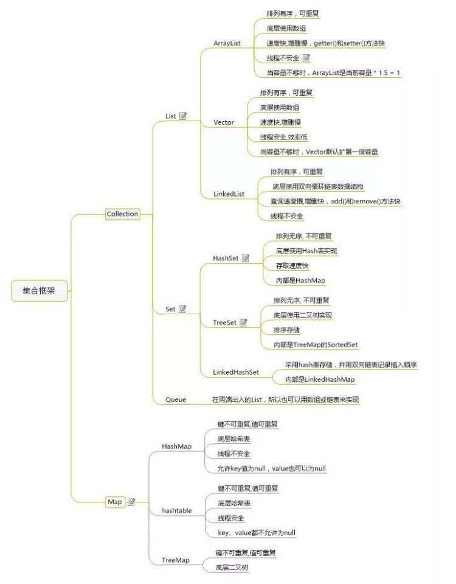

1. 概况

   

2. 细节点

   - HashMap

     - 扩展因子0.75，大于时扩一倍容量。初始默认16，如果初始指定非2^n，则会自动往上扩充到2^n

     - 1.7-数组+链表实现，1.8当链表长度超过8时，改红黑树
     - 1.7的put(null,x)默认放在data[0]
     - 1.7是先扩容后插入新值的，1.8先插值再扩容
     - Collection.synchronizedMap只是在各个方法上加上synchronized关键字而已，本质还是HashMap

   - ConcurrentHashMap

     - 其实就是HashMap基础上加多个Segments数组外壳（Segment内部与HashMap实现稍有不同），Segment继承自ReentrantLock，Segment个数即并发量，默认16，不可扩容，默认初始化Segment[0]
     - 通过计算key的hash，再通过类似掩码计算，确定放哪个Segment
     - 通过while循环尝试获取所在Segment的锁，超过一定次数（单核1多核64）放阻塞队列去等
     - 通过UNSAFE和volatile保证读写并发的安全性
     - 扩容时，1.8的transfer会划分小任务包，可多次执行完成迁移

