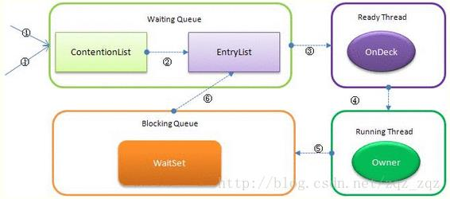

1. 自带线程池中，newCachedThreadPool用的线程池阻塞队列是SynchronousQuene，一种不存数据的阻塞队列，必须要有人取出了才能继续写入。其余线程池中，newFixedThreadPool用LinkedBlockingQueue，newScheduledThreadPool用的是DelayedWorkQueue。

2. 线程的一些操作基本释义 

   - 引用[stackOverflow](https://stackoverflow.com/questions/9700871/what-is-difference-between-sleep-method-and-yield-method-of-multi-threading)的一张图

     

3. 锁

   - 偏向锁

     - 简单理解就是如果当前线程获取到了锁，再进入时不再执行同步块操作，直接执行
     - 单线程或小竞争下同步块的效率会大大提高
     - 多并发时一样惨不忍睹，甚至会因为锁竞争频繁上下文切换导致效率更低

   - 轻量级锁

     - 偏向锁失败时默认申请轻量级锁
     - 虚拟机内部实现
     - 锁住对象头的指针
     - 只需要判断该对象头的指针是否在锁的范围内即可

   - 重量级锁

     - 轻量级锁获取失败时申请重量级锁
     - 操作过程中可能会被操作系统层面挂起，效率低，切换成本高

   - 自旋锁

     - 获取不到锁时，执行空循环
     - 循环一定次数之后还没拿到才挂起阻塞
     - 减少了上下文切换，但是加大了cpu负荷，同步块执行时间长的话cpu负荷很大
     - 1.5只能使用默认配置，1.6可配置等待次数，1.7之后内部自动调整

   - synchronized原理

     - 所有竞争线程都丢到ContentionList（其实是链表），Owner释放锁的时候会将一部分ContentionList线程移动到EntryList。
     - 有资格成为候选的线程从ContentionList丢到EntryList，Owner释放锁的时候会将EntryList的尾部提拔为OnDeck。
     - 获取到锁的线程调用wait之后丢到WaitSet，调用notify或者notifyAll后返回EntryList。
     - 任意时刻最多只有一个线程在竞争锁资源，该线程被称为OnDeck。
     - 获取到锁资源的线程被称为Owner。
     - 已释放锁的线程被称为!Owner。
     - 所有线程进来之后会先跟OnDeck竞争锁，竞争不过才丢到ContentionList（其实就是自旋锁过程），竞争到了，则是将OnDeck丢回EntryList（这不公平）。

     

4. CountDownLatch、CyclicBarrier和Semaphore

   - CountDownLatch（闭锁）
     - 主线程等其他线程执行完再往下执行，不可重复使用。
     - 原理：主线程不停循环，直到计数器为0；其他线程执行完计数器-1。
     - 内部持有一个aqs实现的Sync
   - CyclicBarrier
     - 一组线程达到互相等待直到所有线程达到某个点之后各自再往下执行，可重复使用。
     - 原理：内部持有一个ReentrantLock和Condition
   - Semaphore
     - 指定同时只能有x个线程执行某段代码
     - 内部持有一个aqs实现的Sync

5. volatile

   - 禁止指令重排
   - 永远都读主存的值，但是不保证绝对的新值
   - 适合单纯赋值操作，比如i++，或者i=1

6. 

