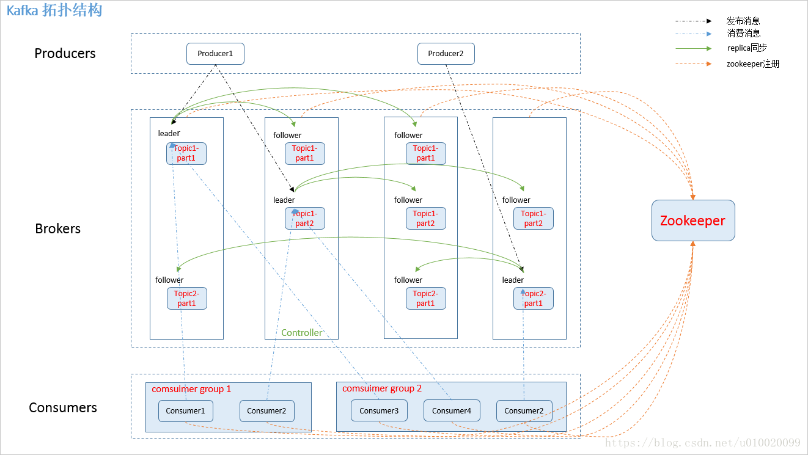
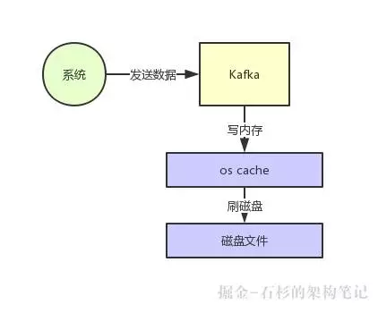
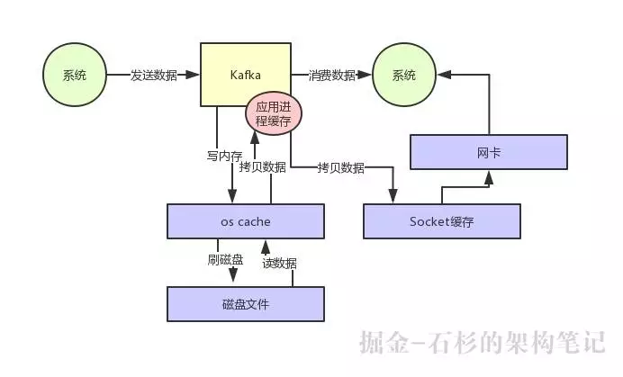
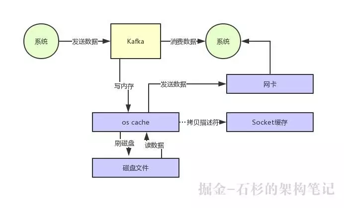

1. 基础名词解释

| 名词      | 解释                                                         |
| --------- | ------------------------------------------------------------ |
| producer  | 生产者，产生数据的，将数据发到指定topic。                    |
| consumer  | 消费者，消费数据的，消费指定topic的数据。                    |
| broker    | 可以理解为kafka服务端的整体，客户端只需要跟他打交道即可，不用关注其内部。 |
| topic     | 理解为消息分类或者消息组即可。                               |
| group     | 消费者组，同一个group对同一个topic的数据只会被消费一次。     |
| message   | 消息本身。组成包括offset、messageSize、data三块，就是字面的意思。 |
| partition | 消息分区，跟topic关联，一个topic可能有多个partition，分布式存储该topic的数据。对生产者和消费者无感知。partition尽可能多过消费者，不然部分消费者可能取不到数据。 |

2. consumer消费topic数据时，并不是像队列那样。具体逻辑是，consumer发送一个topic的offset，然后根据请求数收到一条或者多条数据，并更新consumer本地的offset。kafka对zk间歇性发送当前offset告诉服务端更新该group的最新offset。

   - 新版本改为提交到一个名为__consumeroffsets的topic并永远读取最新的offset，解除了对zk的依赖，相当轻量级。此外consumer还可以将offset往回移再次消费那些消费过的数据。

3. 基于上一点可得知，kafka尽可能保证不丢数据，但是没法很精确保证读取的重复。比如consumer-a提交了一个offset=100给zk，consumer-b消费到offset=110了因为某些因素导致没提交，consumer-a再消费时就可能会取到旧数据。如果要保证不重复需要做很多额外的工作，也就是说，不适合需要保证很完整的收发数据的场景。

4. kafka的数据会根据配置保存一定时间，期间内都可以被消费。如果数据量大且存的时间长，需要考虑好磁盘空间的问题。

5. kafka集群和生产者、消费者都依赖zk，包括调度和维护一些元数据，比如节点信息，比如leader/follower，比如group对topic的offset等。

6. kafka的各实例在出现故障转移争取leader时，根据zk建议，一切从简，第一个获取到node的就是leader了，具体细节zk内部处理（其实就是paxos算法）。

7. kafka的拓扑结构借用[CSDN一篇博文](https://blog.csdn.net/u010020099/article/details/82290403)的一张图，大致如下：

   

8. rebalance相关。此块参考自[cnblogs上的一篇博文](http://www.cnblogs.com/huxi2b/p/6223228.html)

   1. 触发条件
      - consumer组员发生变化
        - 组员主动离开/加入
        - 组员崩溃
      - 正则订阅topic匹配，其实类似组员主动加入
      - topic分区数变了

   2. consumer分配策略
      - round-robin
      - range
      - 支持自定义

   3. 分代管理

      - 按一定规则选出一个coordinator角色（broker中），由它管理整个consumer group。
      - 每次rebalance会生成新的一代成员，旧代consumer成员（大概率还是同一批，但是就是代数不对）获取数据会被拒绝，直到它们都被调整成最新一代。

   4. 通信协议

      - consumer通过发心跳给coordinator维持存在感
      - consumer主动告诉coordinator离开组
      - Heartbeat请求：consumer通过发心跳给coordinator维持存在感
      - LeaveGroup请求：consumer主动告诉coordinator离开组
      - SyncGroup请求：group leader把分配方案告诉组内所有成员
      - JoinGroup请求：成员请求加入组
      - DescribeGroup请求：显示组的所有信息，包括成员信息，协议名称，分配方案，订阅信息等。通常该请求是给管理员使用

   5. 执行流程

      1. 加入组。加入完成后会选出一个组长（group leader），由它确定分配方案，即此步骤是在客户端层面完成的。分配策略见8.2
      2. 同步(SyncGroup)。组员给coordinator发送SyncGroup，leader发分配方案，其余组员发空请求。然后得知自己要消费的分区

   6. 状态转移（这里直接整段借用了，不复杂）

      

      - Dead：组内已经没有任何成员的最终状态，组的元数据也已经被coordinator移除了。这种状态响应各种请求都是一个response： UNKNOWN_MEMBER_ID
      - Empty：组内无成员，但是位移信息还没有过期。这种状态只能响应JoinGroup请求
      - PreparingRebalance：组准备开启新的rebalance，等待成员加入
      - AwaitingSync：正在等待leader consumer将分配方案传给各个成员
      - Stable：rebalance完成！可以开始消费了~

   7. 交互活动（这里的图画得很好，直接整段借用）

      - 组员加入

        

      - 组员失联

        

      - 组员离开

        

      - 提交位移

        

9. 高性能原理（参考[微信文章](https://mp.weixin.qq.com/s/g1TdX3Cce45MlBK384gAWA)）

   - 生产

     - 利用了os cache，先写入os cache（内存），再写入磁盘，而不是直接写磁盘

     - 写入磁盘按顺序写

   - 消费

     - 零拷贝技术。即只读取数据到os cahce，将文件描述符直接给到socket，不再拷贝到应用程序( kafka server)缓存和socket缓存，直接发到网卡，省去缓存拷贝和上下文切换的耗时。

       - 原始的kafka

         

       - 实际的kafka

         

